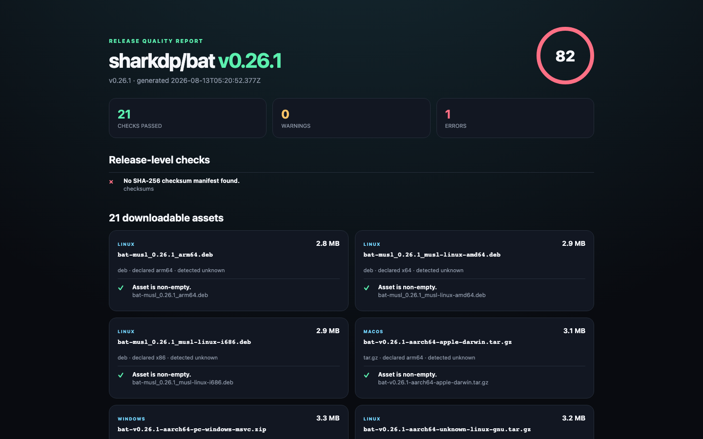

<div align="center">

# ReleaseGuard

[](https://github.com/zhaoryder/releaseguard/actions/workflows/ci.yml) [](https://github.com/zhaoryder/releaseguard/releases/latest) [](https://github.com/marketplace/actions/releaseguard-release-asset-quality-gate) [](LICENSE)

English · [简体中文](README.zh-CN.md)

### Your CI passed. Which download should your user pick?

**A quality gate and download advisor for GitHub Release assets.** Catch missing platforms, mislabeled architectures, empty installers, version drift, and missing checksums—and tell each user which file fits their OS and CPU.

[Quick start](#run-it-in-30-seconds) · [Online demo](https://releaseguard.vercel.app/) · [GitHub Action](#add-the-quality-gate) · [Checks](#what-it-catches) · [Example report](docs/example-report.png)

</div>



```console
$ npx --yes github:zhaoryder/releaseguard check sharkdp/bat

sharkdp/bat v0.26.1  82/100 FAIL
21 assets · 21 passed · 0 warnings · 1 error

× No SHA-256 checksum manifest found.
✓ bat-v0.26.1-aarch64-apple-darwin.tar.gz is non-empty
✓ bat-v0.26.1-x86_64-pc-windows-msvc.zip is non-empty
✓ bat-v0.26.1-x86_64-unknown-linux-gnu.tar.gz is non-empty
```

Building an installer and shipping an installer are different jobs. Problems often appear after compilation: an `arm64` file contains an x64 binary, a tag says `v2.1.0` while the app says `2.0.9`, one platform never made it into the release, or every download exists but nobody published checksums.

ReleaseGuard inspects the release users actually download—not the build folder you hoped you uploaded.

If you ship a desktop, CLI, or mobile release with more than one platform, this is the 30-second preflight worth adding before you share the download link. If it catches a real release bug for you, a Star or a sanitized fixture helps the project grow in the right direction.

**Using GitHub Actions? [Install ReleaseGuard from the Marketplace](https://github.com/marketplace/actions/releaseguard-release-asset-quality-gate).**

## Run it in 30 seconds

No token is required for public repositories. Node.js 20+ is required.

```bash
# Latest release; the final section tells you what to download on this machine
npx --yes github:zhaoryder/releaseguard check cli/cli

# Recommend for a specific device instead of the current machine
npx --yes github:zhaoryder/releaseguard check cli/cli --platform macos --arch arm64

# Exact tag or full GitHub URL
npx --yes github:zhaoryder/releaseguard check owner/repo@v1.2.0
npx --yes github:zhaoryder/releaseguard check https://github.com/owner/repo/releases/tag/v1.2.0

# Save a report teammates can open without installing anything
npx --yes github:zhaoryder/releaseguard check owner/repo --html release-report.html --json release-report.json
```

ReleaseGuard only reads public release metadata and bounded binary headers. It does not execute downloaded installers.

> **macOS:** current community builds carry a complete ad-hoc signature but are not Apple-notarized yet. On first launch, Control-click the app and choose **Open**. A Developer ID–notarized build is planned; never disable Gatekeeper globally.

## Add the quality gate

Create `releaseguard.yml`:

```yaml
requiredPlatforms:
  - macos
  - windows
  - linux
requireChecksums: true
requireVersionInAssets: true
allowPrerelease: false
```

Then add a workflow after your release is published:

```yaml
name: Verify release
on:
  release:
    types: [published]

permissions:
  contents: read

jobs:
  releaseguard:
    runs-on: ubuntu-latest
    steps:
      - uses: actions/checkout@v4
      - uses: zhaoryder/releaseguard@v0.1.0
        with:
          release: ${{ github.repository }}@${{ github.event.release.tag_name }}
```

The Action writes `releaseguard-report.html` and `releaseguard-report.json` for later upload or inspection. It exits non-zero when the configured quality gate fails.

## What it catches

| Check | Example |
|---|---|
| Platform coverage | Windows asset is missing from a macOS/Linux release |
| Declared architecture | Filename says `arm64`, PE/ELF header says `x64` |
| Empty assets | Interrupted upload produced a zero-byte installer |
| Version naming | Release is `v2.4.0`, asset is still named `App-2.3.1.dmg` |
| Checksums | No SHA-256 manifest was published |
| Draft/prerelease policy | A draft or disallowed prerelease reached the gate |
| Size limits | An unexpectedly huge installer entered the release |

PE and ELF executables are inspected directly from their headers. Mach-O detection is available for unwrapped binaries; deep inspection inside DMG, MSI, ZIP, DEB, and RPM containers is on the roadmap.

## What this is not

ReleaseGuard complements provenance and security tooling; it does not replace them.

- [`gh release verify`](https://cli.github.com/manual/gh_release_verify) verifies signed attestations and provenance.
- ReleaseGuard checks whether the published asset set is coherent and usable as a release.
- It does not claim that an application is malware-free or functionally correct.
- It never runs an unknown installer during the default inspection.

## Policy reference

```yaml
requiredPlatforms: [macos, windows, linux]
requireChecksums: true
requireVersionInAssets: true
maxAssetBytes: 1073741824
allowPrerelease: false
```

Use `--fail-on warning` for a strict gate, `--fail-on error` for the default, or `--fail-on never` while introducing ReleaseGuard to an existing project.

## Real-world baseline

The first development scan produced two useful reference points:

- `cli/cli v2.97.0`: **100/100**, with 22 assets and a checksum manifest.
- `sharkdp/bat v0.26.1`: **82/100**, because no SHA-256 checksum manifest was attached to the Release at scan time.

Scores describe the configured release-hygiene checks, not the security or overall quality of those projects.

## Development

```bash
npm install
npm run check
npm test
npm run build
```

ReleaseGuard is local-first, deterministic, and has no telemetry or model calls. MIT licensed.
